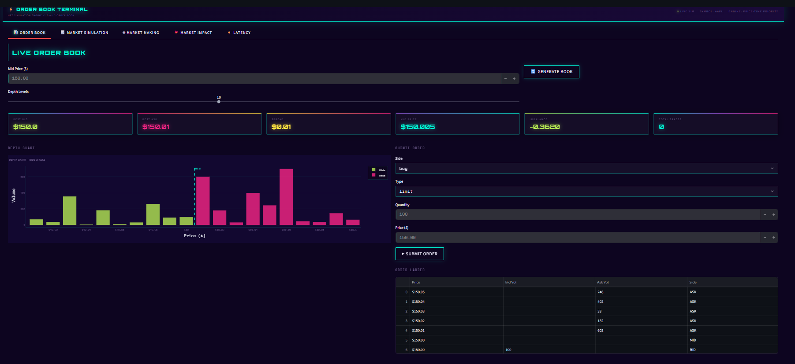
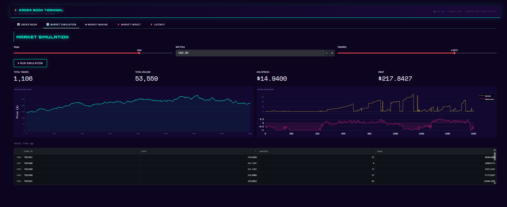
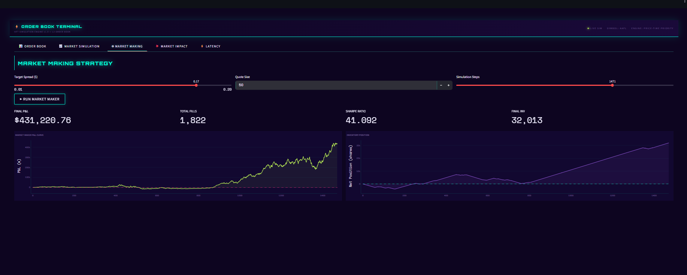
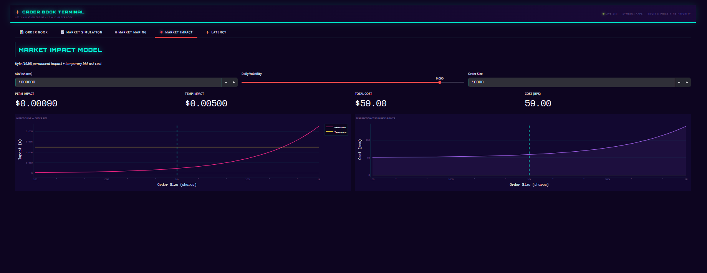
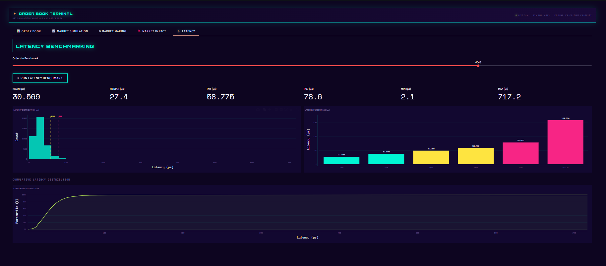

# ⚡ HFT Order Book Simulator


> **Production-grade L2 order book engine** with price-time priority FIFO matching, market/limit/cancel orders, Kyle lambda market impact model, market making strategy simulation, latency benchmarking, and a cyberpunk neon aurora Streamlit dashboard.

---

## 📊 What's Inside

| Module | Details |
|--------|---------|
| **Order Book Engine** | L2 bid/ask book, price-time priority, FIFO matching |
| **Order Types** | Market orders, Limit orders, Cancel orders |
| **Analytics** | Spread, mid price, imbalance, VWAP, depth |
| **Simulator** | Realistic order flow — arrivals, cancellations, market orders |
| **Market Making** | Quote posting strategy — P&L, inventory, Sharpe ratio |
| **Market Impact** | Kyle (1985) lambda + square-root model + cost in bps |
| **Latency** | Microsecond order processing benchmarking |
| **REST API** | FastAPI — submit orders, depth, simulate, impact |

---

## 🖥️ Dashboard Preview

### 📊 Order Book — Live Depth

> Live L2 order book with depth chart showing bids (lime) and asks (pink) around the mid price. Interactive order submission form and order ladder view with price-time priority. KPI strip shows best bid, best ask, spread, mid price, imbalance, and total trades in real time.

### 📈 Market Simulation

> Full order flow simulation — mid price random walk evolution, bid-ask spread over time, and order book imbalance signal. Live trade tape showing filled orders with price, quantity, and value. Configurable volatility and simulation steps.

### 🤖 Market Making Strategy

> Simple market making strategy posting quotes around mid price — cumulative P&L curve, inventory position over time, fill count, and Sharpe ratio. Demonstrates how spread capture generates alpha and how inventory risk accumulates without hedging.

### 💥 Market Impact

> Kyle (1985) permanent + temporary market impact decomposition. Log-scale impact curve showing how transaction cost grows with order size, cost in basis points chart, and per-order impact breakdown. Essential for optimal execution research.

### ⚡ Latency Benchmarking

> Microsecond latency distribution histogram with P95 and P99 markers, percentile bar chart (P50 through P99.9), and cumulative distribution function. Benchmarks order book engine processing speed under realistic load.

---

## 🏗️ Architecture

```
┌──────────────────────────────────────────────────────────────────┐
│                    ORDER BOOK ENGINE                              │
│                                                                   │
│  Order Submission          Matching Engine                        │
│  ────────────────    →    ─────────────────                      │
│  Market Orders             Price-Time Priority                   │
│  Limit Orders              FIFO Queue per level                  │
│  Cancel Orders             Aggressive matching                   │
│  Order ID tracking         Partial fills                         │
│                                    │                              │
│                                    ▼                              │
│                    Book Analytics                                 │
│                    ─────────────────                              │
│                    Best Bid / Best Ask                           │
│                    Spread & Mid Price                            │
│                    Order Book Imbalance                          │
│                    VWAP (rolling 50 trades)                      │
│                    L2 Depth (N levels)                           │
│                    Latency tracking (µs)                         │
│                                    │                              │
│          ┌─────────────────────────┼──────────────┐             │
│          ▼                         ▼              ▼             │
│   Market Impact             Simulator         FastAPI           │
│   ────────────              ─────────         ───────           │
│   Kyle lambda               Order flow        /order            │
│   Square-root               Market making     /book/depth       │
│   Perm + temp               P&L tracking      /simulate         │
│   Cost in bps               Latency bench     /impact           │
│                                    │                              │
│                                    ▼                              │
│                    Streamlit — Cyberpunk UI                      │
│                    Neon Aurora — Deep Space Purple               │
│                    port 8501                                      │
└──────────────────────────────────────────────────────────────────┘
```

---

## ⚙️ Tech Stack

| Layer | Technology | Purpose |
|-------|-----------|---------|
| Order Book | Python collections (deque, defaultdict) | Price-time priority FIFO queues |
| Matching | Custom engine | Limit + market order matching |
| Analytics | NumPy, Pandas | Spread, VWAP, imbalance |
| Simulation | NumPy GBM | Realistic order flow generation |
| Market Impact | SciPy, NumPy | Kyle lambda + sqrt impact |
| REST API | FastAPI + Uvicorn | Order submission + analytics |
| Dashboard | Streamlit + Plotly | 5-tab cyberpunk neon UI |
| Testing | Pytest | 17 unit tests |

---

## 📁 Project Structure

```
hft-order-book-simulator/
├── orderbook/
│   ├── engine.py        # L2 order book — matching, depth, analytics
│   ├── simulator.py     # Order flow simulation + market making strategy
│   └── impact.py        # Kyle lambda + sqrt market impact models
├── api/
│   └── main.py          # FastAPI — orders, depth, simulate, impact
├── dashboard/
│   └── app.py           # 5-tab cyberpunk Streamlit dashboard
├── tests/
│   └── test_orderbook.py # 17 unit tests
├── requirements.txt
├── run_all.py            # Single command runner
└── README.md
```

---

## 🚀 Quick Start

### 1. Clone the repo
```bash
git clone https://github.com/KirtanPatel30/hft-order-book-simulator
cd hft-order-book-simulator
```

### 2. Install dependencies
```bash
pip install -r requirements.txt
```

### 3. Run tests + validation
```bash
python run_all.py
```

### 4. Launch the dashboard
```bash
streamlit run dashboard/app.py
# → http://localhost:8501
```

### 5. Start the REST API
```bash
uvicorn api.main:app --reload
# → http://localhost:8000/docs
```

---

## 🔌 API Endpoints

| Method | Endpoint | Description |
|--------|----------|-------------|
| `GET` | `/health` | Health check |
| `GET` | `/book/summary` | Best bid/ask, spread, VWAP, imbalance |
| `GET` | `/book/depth` | Top N levels of bid/ask depth |
| `POST` | `/order` | Submit market or limit order |
| `GET` | `/latency` | Latency percentile stats |
| `POST` | `/simulate` | Run order flow simulation |
| `GET` | `/impact` | Compute market impact for order size |

### Example — Submit Order
```bash
curl -X POST http://localhost:8000/order \
  -H "Content-Type: application/json" \
  -d '{"side":"buy","price":150.05,"quantity":100,"order_type":"limit"}'
```

```json
{
  "order_id": "API000001",
  "status": "open",
  "filled": 0,
  "trades": 0,
  "summary": {
    "best_bid": 149.99,
    "best_ask": 150.01,
    "spread": 0.02,
    "mid_price": 150.00,
    "imbalance": 0.0312,
    "vwap": 149.98,
    "total_trades": 47
  }
}
```

### Example — Market Impact
```bash
curl "http://localhost:8000/impact?quantity=50000&adv=1000000&sigma=0.02"
```

```json
{
  "permanent_impact": 0.000632,
  "temporary_impact": 0.005000,
  "total_slippage":   0.005632,
  "total_cost":       281.60,
  "cost_bps":         5.63
}
```

---

## 🧠 Key Concepts

### Price-Time Priority (FIFO)
Orders at the same price level are matched in the order they arrive.
Better-priced orders always match before worse-priced orders.
```
Bids: [150.02 x 200, 150.01 x 150, 150.00 x 300]  ← sorted descending
Asks: [150.03 x 100, 150.04 x 250, 150.05 x 200]  ← sorted ascending
```

### Order Book Imbalance
```
Imbalance = (Bid Volume - Ask Volume) / (Bid Volume + Ask Volume)
Range: [-1, +1] — positive means buy pressure, negative means sell pressure
```

### Kyle Lambda (Market Impact)
```
Price Impact = λ × Order Flow
λ = σ / √ADV
```
Where σ = daily volatility, ADV = average daily volume.

### Market Making P&L
```
P&L = Σ(ask fills × ask price) - Σ(bid fills × bid price) + Inventory × Mark Price
Sharpe = E[ΔP&L] / σ[ΔP&L] × √(252 × n_steps)
```

---

## 🧪 Tests

```bash
pytest tests/ -v
```

```
tests/test_orderbook.py::TestOrderBook::test_seed_creates_depth      PASSED
tests/test_orderbook.py::TestOrderBook::test_best_bid_lt_best_ask    PASSED
tests/test_orderbook.py::TestOrderBook::test_spread_positive          PASSED
tests/test_orderbook.py::TestOrderBook::test_mid_price                PASSED
tests/test_orderbook.py::TestOrderBook::test_market_buy_fills         PASSED
tests/test_orderbook.py::TestOrderBook::test_market_sell_fills        PASSED
tests/test_orderbook.py::TestOrderBook::test_limit_order_rests        PASSED
tests/test_orderbook.py::TestOrderBook::test_cancel_order             PASSED
tests/test_orderbook.py::TestOrderBook::test_imbalance_range          PASSED
tests/test_orderbook.py::TestOrderBook::test_latency_recorded         PASSED
tests/test_orderbook.py::TestMatching::test_price_priority            PASSED
tests/test_orderbook.py::TestMatching::test_full_fill                 PASSED
tests/test_orderbook.py::TestMatching::test_trade_recorded            PASSED
tests/test_orderbook.py::TestImpact::test_kyle_lambda_positive        PASSED
tests/test_orderbook.py::TestImpact::test_sqrt_impact_positive        PASSED
tests/test_orderbook.py::TestImpact::test_total_impact_components     PASSED
tests/test_orderbook.py::TestImpact::test_larger_order_higher_cost    PASSED

17 passed
```

---

## 📌 What I Learned

- **Price-time priority** is the foundation of every major exchange — FIFO queues per price level ensure fair matching
- **Order book imbalance** is one of the strongest short-term price direction signals in microstructure research
- **Kyle lambda** reveals that market impact scales with the ratio of order flow to volatility-adjusted volume
- **Market making** earns the spread but accumulates inventory risk — Sharpe degrades rapidly without hedging
- **Microsecond latency** matters in HFT — even Python-level operations can be benchmarked meaningfully at this granularity

---

## 📬 Contact

**Kirtan Patel** — [LinkedIn](https://www.linkedin.com/in/kirtan-patel-24227a248/) | [Portfolio](https://kirtanpatel30.github.io/Portfolio/) | [GitHub](https://github.com/KirtanPatel30)
